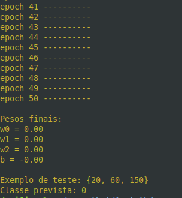

# Perceptron one-layer em C

  
> Fonte: internet  

## Conceito  

O perceptron sem camada oculta pode ser visto como $y = f(w . x + b)$, tendo  
- $x =$ conjunto de entrada;  
- $w =$ pesos;   
- $b =$ viés;    
- $f =$ função de ativação.  

  
> Resultado de uma execução com 50 epochs.  
